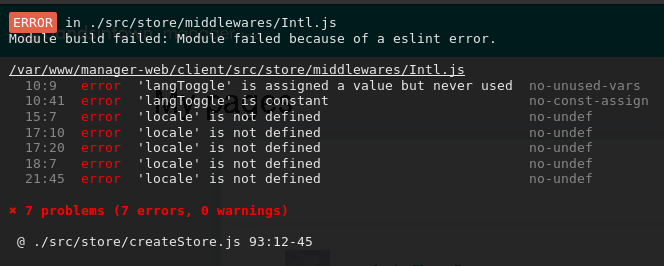

# github-base64-images


# run server
node index.js

#### Testing the web server

# get the javascript file with
curl -i localhost:9000/server.js

# testing with non-existing file
curl -i localhost:9000/invalid-file.doc

____________________________________________________________________

Test #1 (Using Markdown)
- The suggested Mardown approach here (https://github.com/jch/html-pipeline/pull/227)
  does not work in case of Commit messages. See
  https://github.com/marcogadget/github-base64-images/commit/ba3a965fae38e02bb7b2bbb38b20a1970e6dfbd7

Test #2 (Using HTML)
- Does not work. See  previous commit message for result:
  https://github.com/marcogadget/github-base64-images/commit/dcccbabd9838321e9c07934ef0f9a904fc81e9c0

Test #3 (à l'aide d'un fichier dans le répo)



____________________________________________________________________


### About the web server:

    It could be faster to do this way :
    ```
    npm install http-server -g
    ```
    To use it:
    ```
    cd Folder
    http-server
    ```
    Or, like this:
    ```
    http-server /home/user/Folder
    ```

### À propos de conversion d'image en JS:


https://github.com/Automattic/node-canvas
https://github.com/joshmarinacci/node-pureimage
https://www.thepolyglotdeveloper.com/2016/02/convert-an-uploaded-image-to-a-base64-string-in-node-js/

```javascript
var fs = require('fs');

var imageAsBase64 = fs.readFileSync('./your-image.png', 'base64');
```


________________________________________________________________________

## EN DÉTAILS :


#### Ce qui fonctionne :
- Utilisation d'emoji :
  https://www.webpagefx.com/tools/emoji-cheat-sheet/
  (peut-être aussi les sons au bas?)
  (dans ce commit on peut voir les icones : https://github.com/plataformatec/simple_form/commit/42c60520722a80e3ac3ba91fa2a89905db8f9c05)
  https://github.com/dannyfritz/commit-message-emoji

#### Liens intéressants :
http://www.jefclaes.be/2012/04/add-images-to-github-readme.html
https://stackoverflow.com/a/10189374
https://github.com/github/markup/issues/270
https://chris.beams.io/posts/git-commit/#seven-rules

Ici on parle de `language-git` qui permetterais une syntax spécialisé dans les commit :
https://github.com/atom/github/issues/118

Ici à propos de commitView :
https://github.com/atom/github/pull/421

Markdown Cheatsheet :
https://github.com/adam-p/markdown-here/wiki/Markdown-Cheatsheet

Github Advanced Formating :
https://help.github.com/articles/working-with-advanced-formatting/

Ici, peut-être une solution (approche) qui pourrait être intégré dans un extension Chrome et Firefox. L'extension pourrait faire un get de la description soit par API ou directement dans le navigateur et nous l'afficher en HTML après l'avoir converti. https://www.npmjs.com/package/git-commit-markdown

Standard Karma pour les fichiers Changelog. Peut-être une solution là-dedans ?
http://karma-runner.github.io/1.0/dev/git-commit-msg.html

#### Autres billets de blog intéressants
https://tbaggery.com/2008/04/19/a-note-about-git-commit-messages.html
http://365git.tumblr.com/post/3308646748/writing-git-commit-messages

- Il pourrait être une bonne idée aussi de créer un autre répo "screenshots" où vous ajouter vos images avant d'en faire un lien dans un autre.

- Vous pouvez aussi ajouter un lien à votre image comme ceci :
```
[http://example.com/]
[][http://example.com/]
```
- Pour le `Permement Link` on Github, vous pouvez regarder ici :
https://help.github.com/articles/getting-permanent-links-to-files/
ET
https://help.github.com/articles/creating-a-permanent-link-to-a-code-snippet/

#### À chercher :
- On m'avait pourant parlé qu'avec une image SHA, c'était possible..
- language-git
  https://atom.io/packages/language-git
  https://github.com/atom/language-git/blob/master/snippets/language-git.cson

#### Très intéressants : LOL Commits :
https://github.com/mroth/lolcommits


#### Pourquoi ne pas utiliser Atom ?
https://atom.io/ voir language-git
https://flight-manual.atom.io/getting-started/sections/installing-atom/#debian-and-ubuntu-debapt


